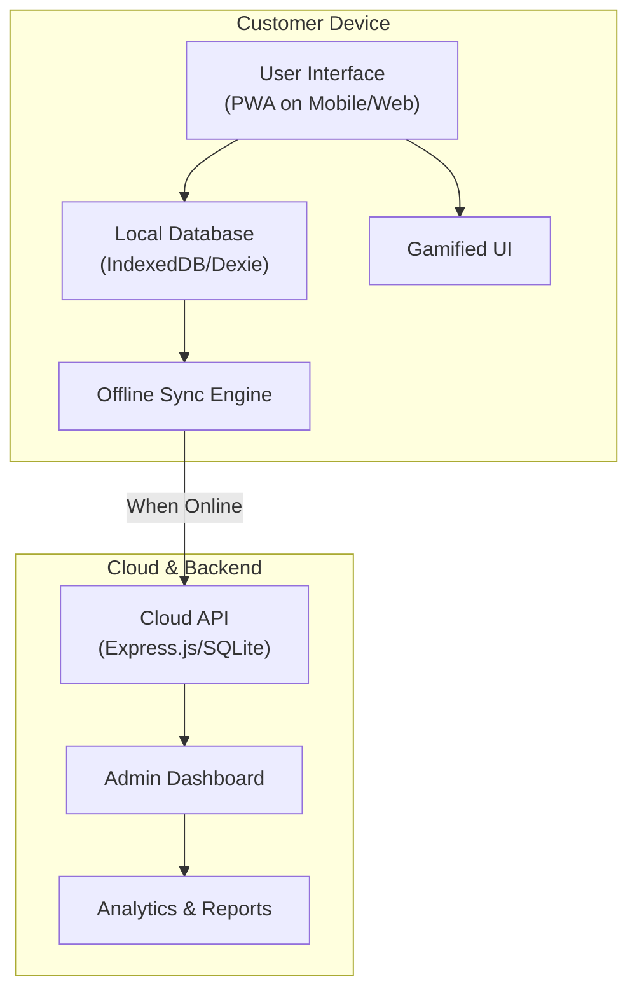

# 🌀 LoopLocal — Offline-First Loyalty Rewards for Local Businesses

[](https://github.com/preston176/looplocal-rewards-mobile)
[](https://github.com/preston176/looplocal-rewards-mobile)

<!-- [](https://github.com/preston176/looplocal-rewards-mobile/blob/main/LICENSE)
[](https://github.com/preston176/looplocal-rewards-mobile/actions) -->

[](https://github.com/preston176/looplocal-rewards-mobile/commits)

> A mobile-first, progressive web app (PWA) that empowers salons, barbershops, and eateries with a smart, **offline-friendly** loyalty rewards system — no app installs needed.

---

## 📚 Table of Contents

- [Why LoopLocal?](#-why-looplocal)
- [Key Features](#-features)
- [Product Overview (Screenshots)](#-product-overview)
- [User Journeys](#-user-journeys)
- [App Architecture](#-app-architecture)
- [Onboarding Flows](#-onboarding-flows)
- [Offline-First Logic](#-offline-first-logic)
- [Testing Scenarios](#-testing-scenarios)
- [Tech Stack](#-tech-stack)
- [Development Setup](#-dev-setup-optional)
- [Localization & Extensibility](#-localization--extensibility)
- [Future Enhancements](#-future-enhancements)
- [Highlight Reel](#highlight-reel)
- [Pitch Deck](#-pitch-deck)
- [Conclusion](#-conclusion)
- [Contact](#-contact)
- [Back to Top ⏫](#top)

<a name="top"></a>

---

## 🧠 Why LoopLocal?

Local businesses often struggle to retain loyal customers due to:

- Lack of affordable customer tracking tools
- Limited internet access
- Low digital adoption among walk-in clients

**LoopLocal** solves this by combining **WiFi-based check-ins**, **QR/NFC fallback**, and **offline-first data syncing** into a seamless experience.

---

## 🚀 Features

### ✅ For Customers

- Check-in automatically via **WiFi login**, **QR scan**, or **NFC tap**
- Earn loyalty points and streak bonuses
- Enjoy gamified rewards (Spin-the-Wheel, Leaderboard)
- Offline-first access with **PWA support**
- View reward progress, invite friends, and redeem offers

### 🧑‍💼 For Business Owners

- Create and manage a loyalty program
- View real-time check-ins and customer data
- Export analytics (CSV/JSON)
- Works even without internet — auto-syncs later

---

## 🖼️ Product Overview

<p align="center">
  
  
  
  
</p>

> _All screenshots are from a mobile device for optimal mobile-first preview._

---

## 📲 User Journeys

### 1. Customer Check-In (WiFi)


---

### 2. Customer Check-In (Offline QR/NFC)


---

### 3. Business View (Owner)


---

## 🧱 App Architecture



---

## 🔐 Onboarding Flows

### 🎉 Customer

1. Open app or WiFi portal
2. Enter phone number (simulate OTP)
3. Start earning points on visits

### 🧑‍💼 Business Owner

1. Register business name & category
2. Define reward tiers (e.g., 5 visits = free item)
3. Access dashboard for metrics & customer info

---

## 📡 Offline-First Logic

- All check-in actions are cached locally
- App detects online status via `navigator.onLine`
- Queued actions sync automatically when reconnected
- Admin dashboard updates in real time post-sync

### Edge Case Handling

- Duplicate visits on same day are ignored
- Stale sync requests are time-filtered
- Points are assigned on first valid connection only

---

## 🧪 Testing Scenarios

| Test Case                      | Expected Result                                    |
| ------------------------------ | -------------------------------------------------- |
| Offline QR check-in            | Check-in cached and synced later                   |
| Multiple check-ins in a day    | Only 1 rewarded per 24h per venue                  |
| Referral link reuse            | Only unique phone numbers rewarded                 |
| Owner logs in with wrong phone | Access denied with retry notice                    |
| Data export                    | File is downloadable, correct data in table format |

---

## 🔧 Tech Stack

| Layer           | Tech                                                          |
| --------------- | ------------------------------------------------------------- |
| Frontend        | PWA (React/Next.js or similar), Tailwind CSS                  |
| Offline Storage | IndexedDB (via Dexie.js or localStorage fallback)             |
| Backend (Edge)  | Express.js / SQLite (or local Node.js server on device)       |
| Captive Portal  | Simulated via router route or real via router login page      |
| Notifications   | Twilio / Africa’s Talking / Firebase (simulated in prototype) |
| QR/NFC Sim      | HTML-based simulation buttons for tap/scan interaction        |

---

## 🛠 Dev Setup (Optional)

> For custom builds

```bash
git clone https://github.com/preston176/looplocal-rewards-mobile.git
cd looplocal-rewards-mobile
npm install
npm start
```

### Using Bun (Recommended for performance)

```bash
bun install
bun start
```

- To simulate offline: disable browser network in DevTools
- To test PWA: install on mobile home screen or use Lighthouse

---

## 🌍 Localization & Extensibility

- ✅ Multi-business support (franchise model)
- ✅ Custom branding (business logos + color themes)
- ✅ Multi-language support (future roadmap)
- ✅ Webhooks for CRM integration (Zapier, etc.)

---

## 💡 Future Enhancements

- AI-based reward suggestions
- NFC business cards for instant referrals
- Voice-enabled customer kiosk mode
- WhatsApp bot for reward balance checks
- IoT beacons for passive check-ins

---

## 👨‍⚖️ Highlight Reel

> LoopLocal is a scalable, offline-first platform that brings modern loyalty systems to underserved local businesses. It mimics big-tech ecosystems (Apple Pay check-ins, Google WiFi captive portals), yet functions **without dependency on full-time internet** or expensive infrastructure. All while giving users **fun, gamified experiences** they already love.

---

## 📊 Pitch Deck

Want an at-a-glance overview of LoopLocal?  
Check out our interactive pitch deck:

[](https://www.canva.com/design/DAGokuiDMXg/1vN4fKRC7XRSbzUZOj3c9w/view?utm_content=DAGokuiDMXg&utm_campaign=designshare&utm_medium=link2&utm_source=uniquelinks&utlId=hb6db3c59f5)

Or view it here:  
🔗 [LoopLocal Pitch Deck on Canva](https://www.canva.com/design/DAGokuiDMXg/1vN4fKRC7XRSbzUZOj3c9w/view?utm_content=DAGokuiDMXg&utm_campaign=designshare&utm_medium=link2&utm_source=uniquelinks&utlId=hb6db3c59f5)

<!--
For external documentation sites (NOT on GitHub), you can embed the deck like this:
<iframe src="https://www.canva.com/design/DAGokuiDMXg/1vN4fKRC7XRSbzUZOj3c9w/view?embed" width="800" height="450" allowfullscreen style="border:none;"></iframe>
-->

## 🏁 Conclusion

LoopLocal empowers small businesses with tech they can afford, and gives customers rewards they’ll love — even without internet.

> Built with ❤️ to help small businesses stay competitive.

---

## 📬 Contact

Made for [PLP Vibe Coding Hackathon](https://powerlearnprojectafrica.org/) by [Preston Mayieka](https://www.linkedin.com/in/preston-mayieka)  
GitHub: [preston176](https://github.com/preston176)  
Email: [prestonynamweya@example.com](mailto:prestonynamweya@example.com)  
Twitter: [@preston_Mayieka](https://twitter.com/preston_Mayieka)  
LinkedIn: [linkedin.com/in/preston-mayieka](https://www.linkedin.com/in/preston-mayieka)

---

<p align="right">
  <a href="#top">Back to Top ⏫</a>
</p>
